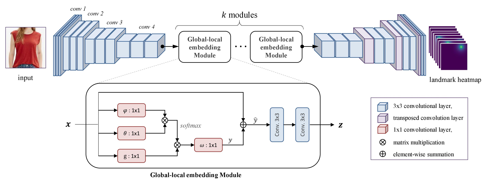

## A Gobal-local Embedding Module for Fashion Landmark Detection

Source code for the paper '[A Global-local Embedding Module for Fashion Landmark Detection](https://arxiv.org/abs/1908.10548)'

Authors : [Sumin Lee](https://sites.google.com/view/suminlee/), Sungchan Oh, Chanho Jung, Changick Kim

Accepted to ICCV 2019 Workshop [Computer Vision for Fashion, Art, and Design](https://sites.google.com/view/cvcreative/home?authuser=0)




### Requirements
- Python 3
- Pytorch >= 0.4.1
- torchvision


### Quick Start
* We refered the code in [[site](https://github.com/fdjingyuan/Deep-Fashion-Analysis-ECCV2018)].
#### 1. Download the datasets
* Deepfashion [[download](http://mmlab.ie.cuhk.edu.hk/projects/DeepFashion/AttributePrediction.html)]
* FLD [[download](http://mmlab.ie.cuhk.edu.hk/projects/DeepFashion/LandmarkDetection.html)]

#### 2. Unzip './Anno/info.zip' file.

#### 3. Train
```
# 'root' and 'dataset' options are necessary.
python train.py --root [root_directory] --dataset [dataset_option] --glem [glem_option]
```

#### 4. Evaluate
```
# You can run the file only for evaluation
python train.py --root [root_directory] --dataset [dataset_option] --glem [glem_option] --evaluate True
```

--------------

### Abstract

Detecting fashion landmarks is a fundamental technique for visual clothing analysis. Due to the large variation and non-rigid deformation of clothes, localizing fashion landmarks suffers from large spatial variances across poses, scales, and styles. Therefore, understanding contextual knowledge of clothes is required for accurate landmark detection. To that end, in this paper, we propose a fashion landmark detection network with a global-local embedding module. The global-local embedding module is based on a non-local operation for capturing long-range dependencies and a subsequent convolution operation for adopting local neighborhood relations. With this processing, the network can consider both global and local contextual knowledge for a clothing image. We demonstrate that our proposed method has an excellent ability to learn advanced deep feature representations for fashion landmark detection. Experimental results on two benchmark datasets show that the proposed network outperforms the state-of-the-art methods.

### Results

- FLD

|            	| L.Collar 	| R.Collar 	| L.Sleeve 	| R.Sleeve 	| L.Waistline 	| R.Waistline 	|  L.Hem 	|  R.Hem 	|  Avg.  	|
|:----------:	|:--------:	|:--------:	|:--------:	|:--------:	|:-----------:	|:-----------:	|:------:	|:------:	|:------:	|
| [FashionNet](http://www.ee.cuhk.edu.hk/~xgwang/papers/liuLQWTcvpr16.pdf) 	|  0.0781  	|  0.0803  	|  0.0975  	|  0.0923  	|    0.0874   	|    0.0821   	| 0.0802 	| 0.0893 	| 0.0859 	|
|     [DFA](https://arxiv.org/pdf/1608.03049.pdf)    	|  0.0480  	|  0.0480  	|  0.0910  	|  0.0890  	|      -      	|      -      	| 0.0710 	| 0.0720 	| 0.0680 	|
|    [DLAN](https://arxiv.org/pdf/1708.02044.pdf)    	|  0.0531  	|  0.0547  	|  0.0705  	|  0.0735  	|    0.0752   	|    0.0748   	| 0.0693 	| 0.0675 	| 0.0672 	|
|   [BCRNNs](http://web.cs.ucla.edu/~yuanluxu/publications/fashion_grammar_cvpr18.pdf)   	|  0.0463  	|  0.0471  	| **0.0627**|**0.0614**	|    0.0635   	|    0.0692   	| 0.0635 	|**0.0527**| 0.0583 	|
|    Ours    	| **0.0386**| **0.0391**|  0.0675  	|  0.0672  	|  **0.0576** 	|  **0.0605** 	|**0.0615**| 0.0621 	|**0.0568** |

- Deepfashion

|            	| L.Collar 	| R.Collar 	| L.Sleeve 	| R.Sleeve 	| L.Waistline 	| R.Waistline 	|  L.Hem 	|  R.Hem 	|  Avg.  	|
|:----------:	|:--------:	|:--------:	|:--------:	|:--------:	|:-----------:	|:-----------:	|:------:	|:------:	|:------:	|
| [FashionNet](http://www.ee.cuhk.edu.hk/~xgwang/papers/liuLQWTcvpr16.pdf) 	|  0.0854  	|  0.0902  	|  0.0973  	|  0.0935  	|    0.0854   	|    0.0845   	| 0.0812 	| 0.0823 	| 0.0872 	|
|     [DFA](https://arxiv.org/pdf/1608.03049.pdf)    	|  0.0628  	|  0.0638  	|  0.0658  	|  0.0621  	|    0.0726   	|    0.0702   	| 0.0658 	| 0.0663 	| 0.0660 	|
|    [DLAN](https://arxiv.org/pdf/1708.02044.pdf)    	|  0.0570  	|  0.0611  	|  0.0672  	|  0.0647  	|    0.0703   	|    0.0694   	| 0.0624 	| 0.0627 	| 0.0643 	|
|   [BCRNNs](http://web.cs.ucla.edu/~yuanluxu/publications/fashion_grammar_cvpr18.pdf)   	|  0.0415  	|  0.0404  	|  0.0496  	|  0.0449  	|    0.0502   	|    0.0523   	| 0.0537 	| 0.0551 	| 0.0484 	|
| [Lie et al](http://openaccess.thecvf.com/content_ECCVW_2018/papers/11131/Liu_Deep_Fashion_Analysis_with_Feature_Map_Upsampling_and_Landmark-driven_Attention_ECCVW_2018_paper.pdf)  	|  0.0332  	|  0.0346  	|  0.0487  	|  0.0519  	|    0.0422   	|    0.0429   	| 0.0620 	| 0.0639 	| 0.0474 	|
|    Ours    	|**0.0312**	|**0.0324**	|**000427**	|**0.0434**	|  **0.0361** 	|  **0.0373** 	|**0.0442**|**0.0475**|**0.0393**|
--------------


### Citation
```
@inproceedings{lee2019global,
  title={A Global-Local Embedding Module for Fashion Landmark Detection},
  author={Lee, Sumin and Oh, Sungchan and Jung, Chanho and Kim, Changick},
  booktitle={Proceedings of the IEEE International Conference on Computer Vision Workshops},
  pages={0--0},
  year={2019}
}
```

